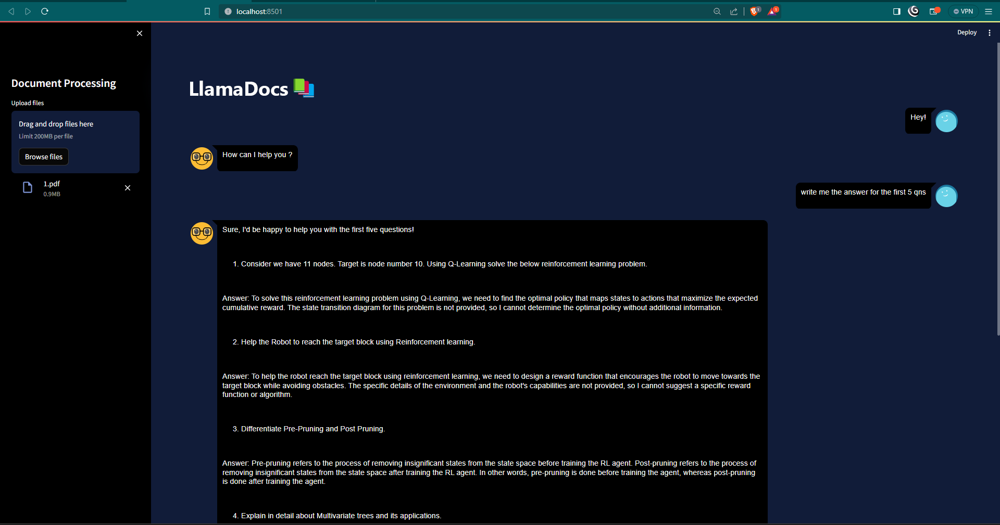

# 🦙 LlamaDocs

**LlamaDocs** is a Python-based application that enables users to interact with documents using natural language. Powered by **Llama 2** and **LangChain**, LlamaDocs transforms PDFs and other text files into a conversational experience—making document querying simple, intuitive, and efficient.



---

## ✨ Features

- 🔍 **Data-Driven Extraction** via Llama 2
- 💬 **Conversational Interface** using LangChain
- 📄 **Supports Multiple Formats**: PDF, DOCX, TXT
- ⚙️ **Streamlit UI** for a seamless experience
- 🔐 **Environment-Based Configuration**

---

## 🧰 Prerequisites

Before getting started, ensure you have:

- Python 3.8 or higher
- API key for Llama 2 (or your chosen model provider)
- Required Python libraries (listed in `requirements.txt`)

---

## 🚀 Setup

1. **Clone the Repository**
   ```bash
   git clone https://github.com/kasiviswanathanR/LlamaDocs.git
   cd LlamaDocs


2. **Install Dependencies**

   ```bash
   pip install -r requirements.txt
   ```

3. **Set Up Environment Variables**

   Create a `.env` file in the root directory:

   ```env
   # .env
   API_KEY=your_llama2_api_key
   ```

   Replace `your_llama2_api_key` with your actual API key.

---

## 🧪 Usage

1. **Run the App**

   ```bash
   streamlit run app.py
   ```

2. **Open in Browser**
   Navigate to `http://localhost:8501` to access the interface.

3. **Upload & Chat**

   * Upload PDF, DOCX, or TXT files
   * Start querying with natural language prompts

---

## ⚙️ Configuration

* Edit `app.py` to tweak interface and interaction behaviour.
* Use the `.env` file to securely manage your API keys and configs.

---

## 🤝 Contributing

Found a bug? Have a feature idea?
Feel free to [open an issue](https://github.com/kasiviswanathanR/LlamaDocs/issues) or submit a pull request!

---

## 📜 License

This project is licensed under the [MIT License](LICENSE).

---
